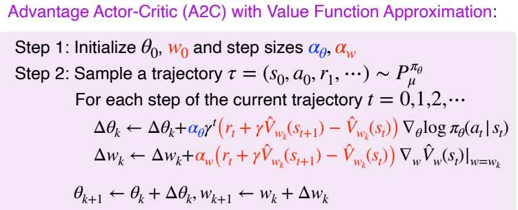
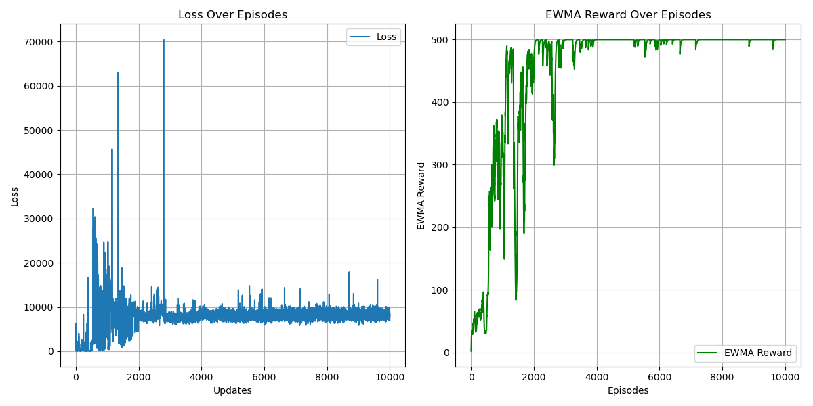

# Advantage Actor-Critic (A2C) Algorithm
## Paper
* Advantage Actor-Critic (Synchronous version of Asynchronous Advantage Actor-Critic)
  * https://arxiv.org/abs/1602.01783
## Main Algorithm
* Similar to REINFORCE with Baseline
* Actor-Critic
  * Deep neural networks for function approximation
  * Combining actor and critic
  * Sampling action by probability
* 
* Monte Carlo Estimation
  * State Value loss
* Advantage for variance reduction
  * Policy loss
  * $\nabla_\theta J(\theta)=\mathbb E_{\pi}[A^\pi(s,a)\nabla_\theta log_{\pi_\theta}(a|s)]$
    * where $A^\pi(s,a)=Q^\pi(s,a)-V^\pi(s)$
* Trying to add **entropy loss**
## Figure Out
* Policy-Based
* Model-Free
* ON-Policy
* Actor-Critic
* Stochastic PG
  * Using one trajectory sample instead of expectation
* CUDA device usage
* learning rate = 0.01
* total_episodes = 10000
* hidden_size = 128
* gamma = 0.999
* ewma_reward usage
## Environment and Target Game
* gym: 0.26.2
* numpy: 1.26.4 
* pytorch: 2.5.0 
* environment: "CartPole-v1"
## Result
* 