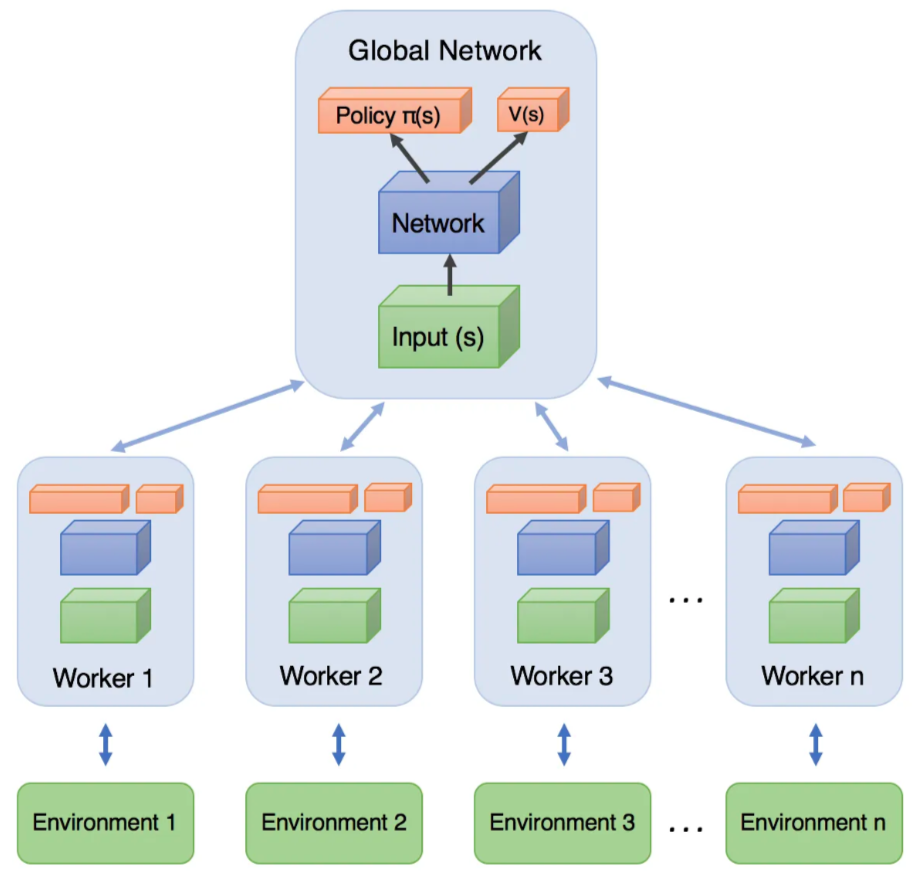
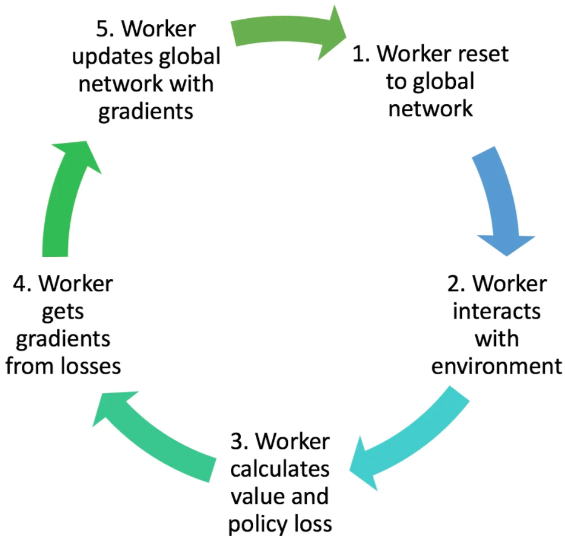
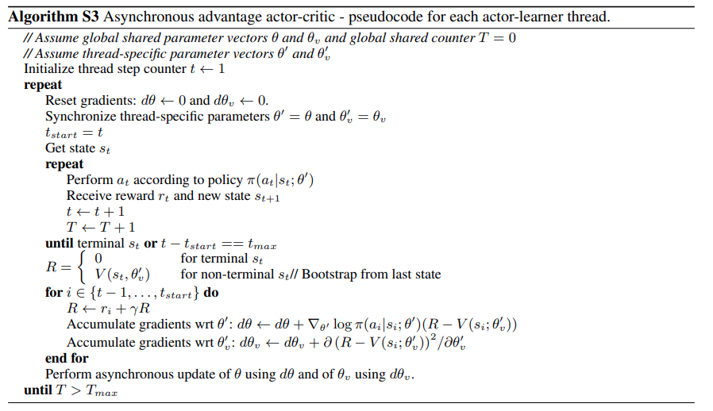
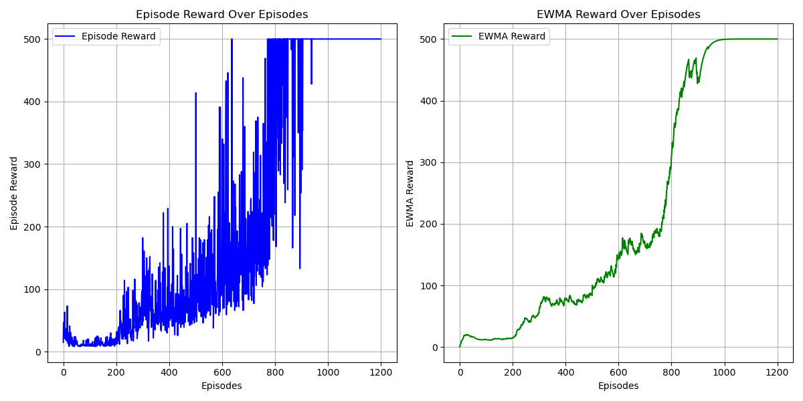
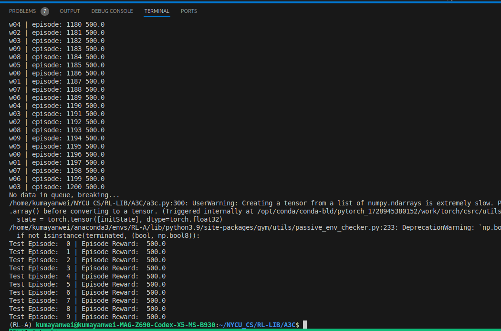

# Asynchronous Advantage Actor-Critic (A3C) Algorithm
## Paper
* Asynchronous Advantage Actor-Critic
  * https://arxiv.org/abs/1602.01783
* Actor-Critic
  * https://proceedings.neurips.cc/paper/1999/hash/6449f44a102fde848669bdd9eb6b76fa-Abstract.html
## Main Algorithm
* Similar to REINFORCE with Baseline
* With Asynchronous environment interaction
  * 
  * Each round, Child:
    * Syncing and pull global network model
    * Interacting and training
    * Updating gradient to global network model
      * Share ADAM for share information of gradient calculation procedure between several child processes
* Actor-Critic
  * Deep neural networks for function approximation
  * Distinct NN for Actor and Critic (value function)
  * Sampling action by probability
* 
* 
* Monte Carlo Estimation
  * State Value loss
* Advantage for variance reduction
  * Policy loss
  * $\Large \nabla_\theta J(\theta)=\mathbb E_{\pi}[A^\pi(s,a)\nabla_\theta log_{\pi_\theta}(a|s)]$
    * where $\Large A^\pi(s,a)=Q^\pi(s,a)-V^\pi(s)$
* With **entropy loss**
## Figure Out
* Policy-Based
* Model-Free
* ON-Policy
* Actor-Critic
* Multi-Processing: 10 child
* Stochastic PG
  * Using one trajectory sample instead of expectation
  * Use state value $G_t(\tau)$ of one trajectory sample as unbiased estimate of state-action value $Q^{\pi_\theta}(s_t,a_t)$
  * Also, you can consider it as state value $V^{\pi_\theta}(s_t)$ estimation
* CPU device usage
* learning rate = 0.001
* total_episodes = 1400
* hidden_size = 256
* gamma = 0.999
* ewma_reward usage
## Environment and Target Game
* gym: 0.26.2
* numpy: 1.26.4 
* pytorch: 2.5.0 
* environment: "CartPole-v1"
## Result
* 
* * 
  * After 1200 epsidoes training, it can obtain better result than A2C.
  * The result might not identical each time due to different process schedule of CPU by OS.