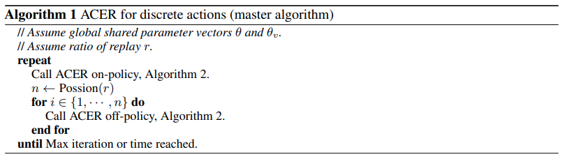
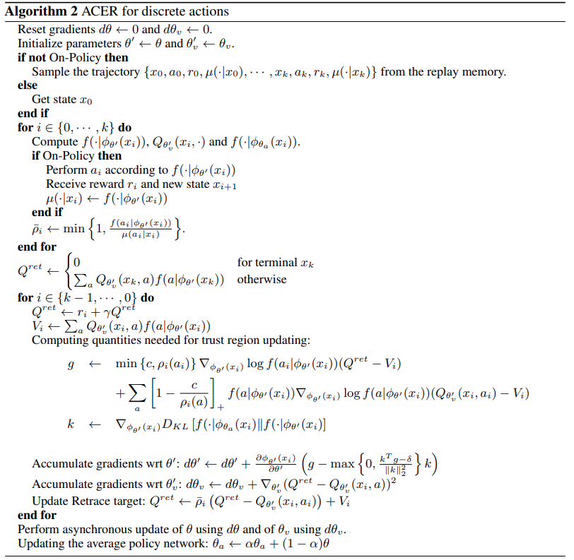
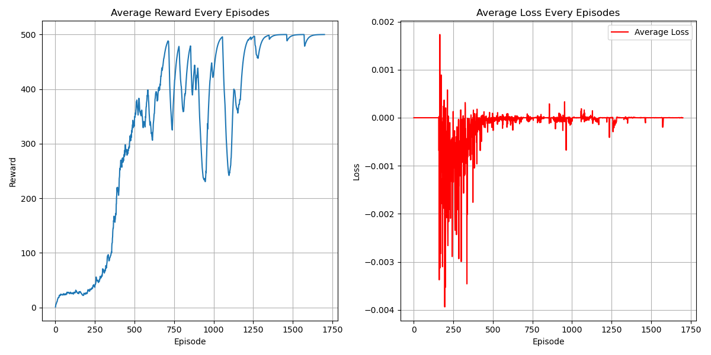

# Actor Critic with Experience Replay (ACER) Algorithm
## Paper
* https://arxiv.org/pdf/1611.01224
## Main Algorithm
* Similar to A2C but with experience replay and offline training
* Actor-Critic
  * Deep neural networks for function approximation
  * Combining actor and critic
  * Sampling action by probability
* 
* 
* Advantage for variance reduction
* Reward scaling prevents large and unstable Q-values, reducing variance in importance sampling
* Rollouts and truncating importance sampling ratio limits variance
* Bias terms compensates loss from truncating importance sampling ratio
* ACER Objective:
  * Off-policy policy + Bias term 
  * $\Large J_\pi(\theta)=min\{c,\rho_i(a_i)\}\log f(a_i|\phi_\theta(x_i))(Q^{retrace}_i-V_i)\\ +\Sigma_a[1-\frac{c}{\rho_i(a)}] f(a|\phi_\theta(x_i))\log f(a_i|\phi_\theta(x_i))(Q_{\psi}(x_i,a)-V_i)$
  * $\Large min\{c,\rho_i(a_i)\}$ is truncating importance sampling ratio
  * $\Large f(a_i|\phi_\theta(x_i))$ is off-policy
  * $\Large Q^{retrace}$ is Q evaluation from off-policy with importance sampling ratio
  * $\Large 1-\frac{c}{\rho_i(a)}$ is bias correction coefficient
## Figure Out
* Policy-Based
* Model-Free
* OFF-Policy
* Without trust-region updates
* Actor-Critic
* Retrace evaluation
* CUDA device usage
* learning rate = 0.0002
* total_episodes = 6000
* hidden_size = 256
* gamma = 0.98
* rollout_len = 10
* clamp = 1.0
* ewma_reward usage
## Environment and Target Game
* gym: 0.26.2
* numpy: 1.26.4 
* pytorch: 2.5.0 
* environment: "CartPole-v1"
## Result
* 
