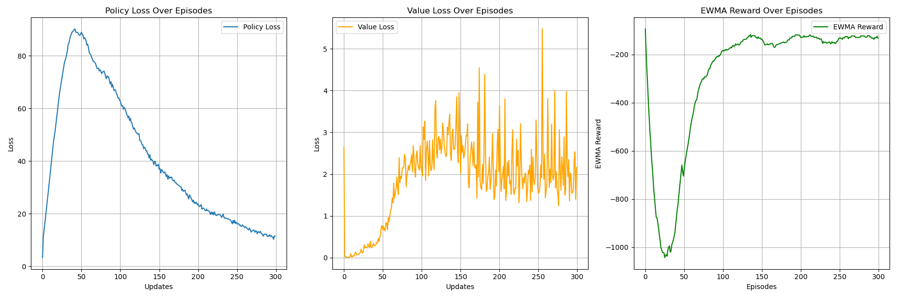

# DDPG (Deep Deterministic Policy Gradient) Algorithm
## Paper
* DPG: https://proceedings.mlr.press/v32/silver14.html
* DDPG: https://arxiv.org/abs/1509.02971
## Main Algorithm
* An variation of Off-Policy Deterministic Actor-Critic
  * Deep neural networks for function approximation
  * Experience Replaying
  * Ornstein-Uhlenbeck process for exploartion
* Actor-Critic
  * Using target network to evaluate next state q value and calculate current q value
  * By DPG theory, policy gradient under the deterministic policy is **identical** to expected gradient of q value under the deterministic policy
    * **Directly using critic value as loss function**
    * $\nabla_{\theta^\mu}J=\frac{1}{N}\Sigma\nabla_aQ(s,a|\theta^Q)|_{s=si,a=\mu(si)}\nabla_{\theta^\mu}\mu(s|\theta^\mu)|_{si}$
      * $=\nabla_{\theta^\mu}Q(s,a|\theta^Q)$
* 
* 
* 
## Figure Out
* Policy-Based
* Model-Free
* OFF-Policy
* Deterministic Policy
* Actor-Critic
* Per-step training
* Soft copy with $\tau$
* Ornstein-Uhlenbeck process
* CUDA device usage
* Target evaluation without gradient back propagation (add model.eval)
* total_episodes = 300
* batch_size = 128
* gamma      = 0.995
* replay_buffer capacity 100000
* tau = 0.002
* noise_scale = 0.3
* replay_size = 100000  
* ewma_reward usage
## Environment and Target Game
* gym: 0.26.2
* numpy: 1.26.4 
* pytorch: 2.0.1 
* environment: "Pendulum-v1"
## Result
* 