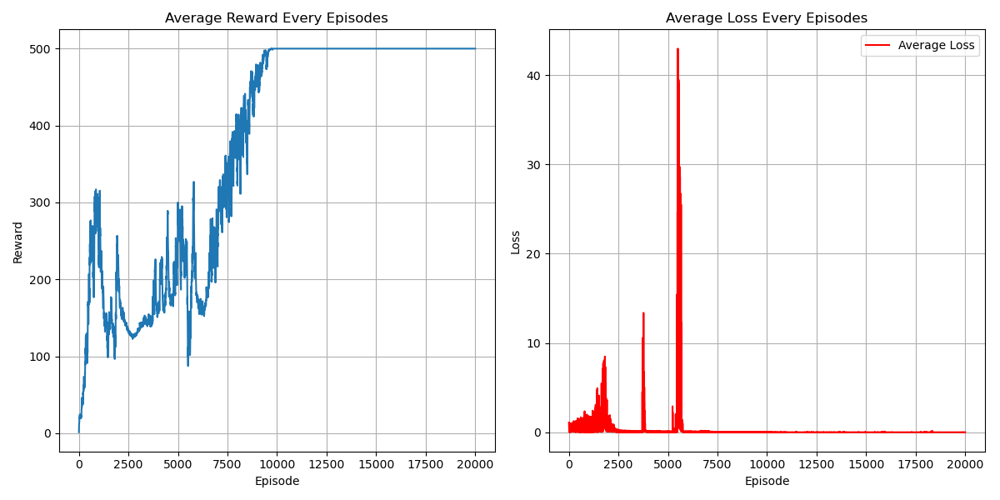

# DDQN (Double DQN) Algorithm
## Paper
* https://doi.org/10.1609/aaai.v30i1.10295
## Main Algorithm
* Using predict network to find action with maximal q value of next state, then using target network to evaluate next state q value of that action
  * $\Large y_t = r_{t+1}+\gamma \hat Q(s_{t+1},argmax_{a'}Q(s_{t+1},a',w),\hat w)$
* 
* 
## Figure Out
* Value-Based
* Model-Free
* OFF-Policy
* Per-episode training instead of per-step
* Hard copy every 50 step
* Epsilon greedy decay as episodes increase
* CUDA device usage
* Target evaluation without gradient back propagation (add model.eval)
* total_episodes = 20000
* batch_size = 256
* gamma      = 0.99
* replay_buffer capacity 10000
* ewma_reward usage
## Environment and Target Game
* gym: 0.26.2
* numpy: 1.26.4 
* pytorch: 2.0.1 
* environment: "CartPole-v1"
## Result
* 
