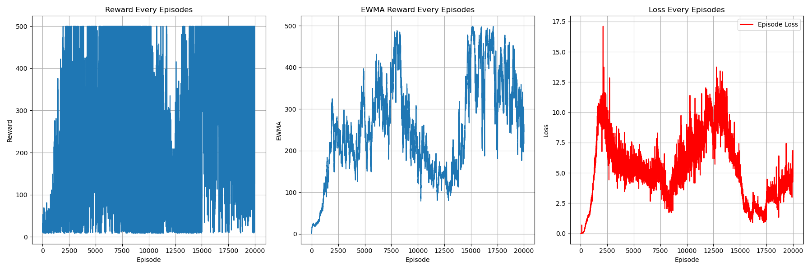

# DRQN (Deep Recurrent QN) Algorithm
## Paper
* https://arxiv.org/pdf/1507.06527
## Main Algorithm
* Same as DQN, the only difference is NN architecture and Replay Mechanism
  * 
* 
## Figure Out
* Value-Based
* Model-Free
* OFF-Policy
* Per-step training
  * select whole episode trajectory (history)
  * select random segment from episode trajectory (history)
* Dimension
  * Normal DQN [batch_size, state_dim]
  * DRQN [batch_size, seq_len, state_dim]
    * Adding a time dimension (sequence length)
* LSTM + Deep Q network architecture
  * Recurrent Hidden States usage
* Soft copy every 4 step
* Epsilon greedy decay as episodes increase
* CUDA device usage
* Target evaluation without gradient back propagation 
* total_episodes = 20000
* batch_size = 64
* gamma      = 0.99
* soft update tar = 1e-2
* replay_buffer capacity 1000
* ewma_reward usage
## Environment and Target Game
* gym: 0.26.2
* numpy: 1.26.4 
* pytorch: 2.5.0 
* environment: "CartPole-v1" with partial observation
  * omitting velocity
## Result
* 