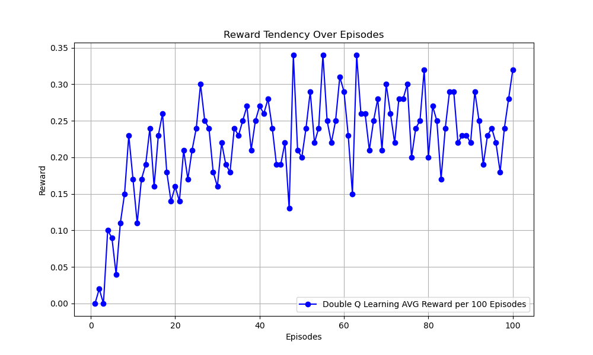

# Double Q Learning Algorithm
## Paper
* https://proceedings.neurips.cc/paper/2010/hash/091d584fced301b442654dd8c23b3fc9-Abstract.html
## Main Algorithm
* $Q_A(S, A) = Q_A(S, A) + \alpha(R + (\gamma Q_B(S', argmax_aQ_A(S',a) ) - Q_A(S, A))$
* $Q_B(S, A) = Q_B(S, A) + \alpha(R + (\gamma Q_A(S', argmax_aQ_B(S',a) ) - Q_B(S, A))$
* 
## Figure Out
* Value-Based
* Model-Free
* OFF-Policy
* Epsilon greedy
  * epsilon = 0.2
* total_episodes = 20000
* max_steps = 100
* alpha = 0.1
* gamma = 1
  * finite step
## Environment and Target Game
* gym: 0.26.2
* numpy: 1.26.4 
* pytorch: 2.0.1 
* environment: "FrozenLake-v1"
## Result
* 