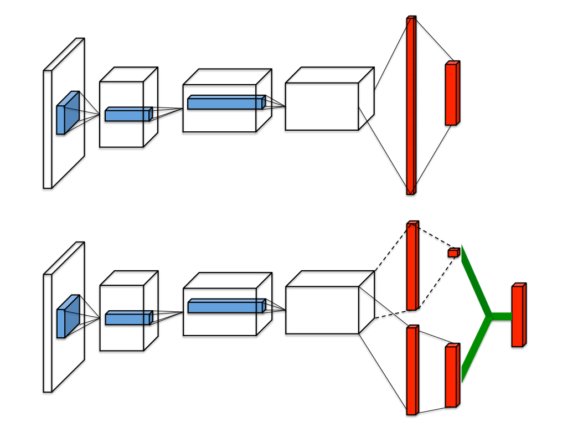
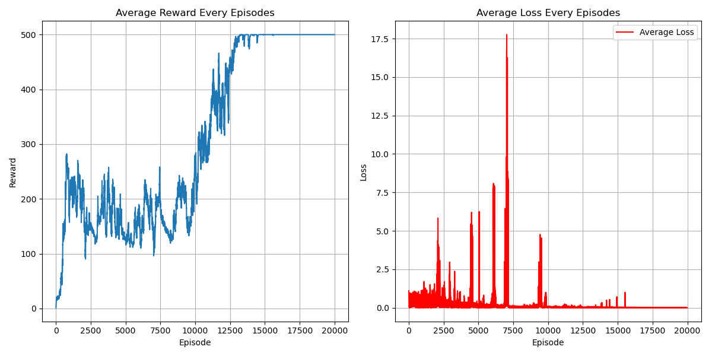

# Dueling DQN Algorithm
## Paper
* https://arxiv.org/abs/1511.06581
## Main Algorithm
* Same as DQN, the only difference is NN architecture
  * 
  * $\Large Q(s,a,w)=V(s,w^V)+A(s,a,w^A)-mean_aA(s,a,w^A)$
  * 假設state是discrete，只有四個，而action只有三個，其𝑄(s,a)由一個table來表示。 𝑉(s)是對不同state都有一個值，𝐴(s,a)是不同state對不同action都有一個值，將𝑉的值加到𝐴的每一個column就可以得到𝑄(s,a)就可以。 這麼做的好處在於，如果只有更動某一個state的兩個action的值，而模型最終決定更動的是𝑉(s)，那最終受影響的不只是兩個action，所是三個action都會受到影響。這意味著即使你沒有sample過的action也會有相對應的影響，也沒有必要全部的state-action pair都一定要sample過，只要𝑉(s)有異動就全部通通異動。
  * 為了避免機器最後讓所有𝑉(s)都是0而造成𝑄(s,a) = 𝐴(s,a)，實作上會對𝐴(s,a)做一些約束，近而讓機器更新𝑉(s)，實作上約束項可以做normalization (mean)。
* 
## Figure Out
* Value-Based
* Model-Free
* OFF-Policy
* Per-episode training instead of per-step
* Dueling Q network architecture
* Hard copy every 100 step
* Epsilon greedy decay as episodes increase
* CUDA device usage
* Target evaluation without gradient back propagation (add model.eval)
* total_episodes = 20000
* batch_size = 256
* gamma      = 0.99
* replay_buffer capacity 10000
* ewma_reward usage
## Environment and Target Game
* gym: 0.26.2
* numpy: 1.26.4 
* pytorch: 2.0.1 
* environment: "CartPole-v1"
## Result
* 
