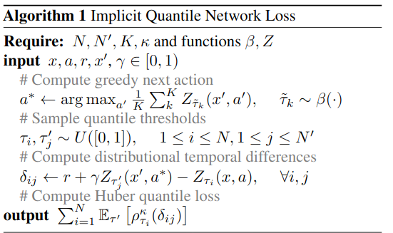
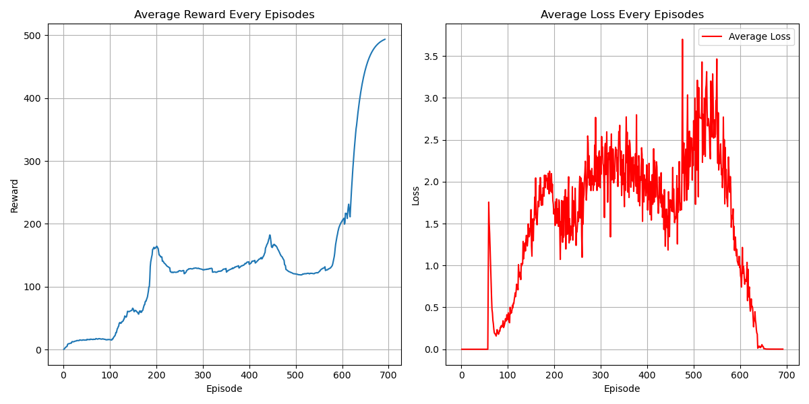

# Implicit Quantile Network (IQN) Algorithm
## Paper
* https://arxiv.org/abs/1806.06923
## Main Algorithm
* 
* 
## Figure Out
* Distributional Value-Based
* Model-Free
* OFF-Policy
* Per-step training
* Hard copy every 100 step
* Epsilon greedy decay as episodes increase
* CUDA device usage
* Target evaluation without gradient back propagation (add model.eval)
* total_episodes = 10000 with early terminating
* batch_size = 32
* gamma      = 0.99
* replay_buffer capacity 1000
* ewma_reward usage
* num_quantile_sample = 32
* num_tau_sample = 16
* num_tau_prime_sample = 8
* quantile_embedding_dim = 64
## Environment and Target Game
* gym: 0.26.2
* numpy: 1.26.4 
* pytorch: 2.0.1 
* environment: "CartPole-v1"
## Result
* 
