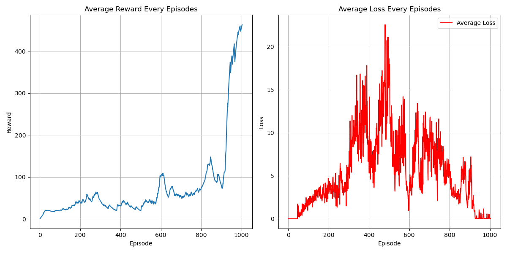

# Implicit Quantile Network (IQN) Algorithm
## Paper
* https://arxiv.org/abs/1806.06923
## Main Algorithm
* Distributional RL via a generative model for distribution Z
  * without explicitly expressing quantiles
    * just sample the quantiles
  * 
* Using Quantile Regression Loss from Target Quantiles
  * $\Large \tau,\tau'\sim U([0,1])$
  * $\Large L_{I}(x;\tau',\tau)=E_{\tau'}[\rho^\kappa_\tau(\delta_t^{\tau\tau'})]$
  * $\Large \delta_t^{\tau\tau'}=B^*Z_{\tau'\hat\theta}(s,a)-Z_{\tau\theta}(s,a)=r+\gamma Z_{\tau'\hat\theta}(s',a^*)-Z_{\tau\theta}(s,a)$
  * $\Large \rho^\kappa_\tau(u)=L_\kappa(u)|\tau-\mathbb I_{\{u<0\}}|$
    * $\Large L_\kappa(u)$ is Huber loss
* Quantile Embedding via Positional Encoding
  * similar to Positional Encoding in transformer
  * 
* Procedures
  1. Target quantile calculation using ($\Large \tau'$)
  2. Predicted quantile ($\Large \tau$)
  3. Pairwise Differences
  4. Including Huber loss to reduce sensitivity to outliers
       * Using smooth_l1_loss instead of original Huber loss
  5. Quantile Thresholds (τ)
  6. Incorporating Huber loss and quantile weights to calculate Asymmetric Quantile Penalty 
        * Higher quantiles (τ>0.5) penalize under-predictions more heavily
        * Lower quantiles (τ<0.5) penalize over-predictions more heavily
* 
## Figure Out
* Distributional Value-Based
* Model-Free
* OFF-Policy
* Per-step training
* Hard copy every 100 step
* Epsilon greedy decay as episodes increase
* CUDA device usage
* Target evaluation without gradient back propagation (add model.eval)
* total_episodes = 10000 with early terminating
* batch_size = 32
* gamma      = 0.99
* replay_buffer capacity 1000
* ewma_reward usage
* num_quantile_sample = 32, for single action selectioin
* num_tau_sample = 16, for prediction usage with batch ($\Large \tau$)
* num_tau_prime_sample = 8, for target estimation with batch ($\Large \tau'$)
* quantile_embedding_dim = 64
## Environment and Target Game
* gym: 0.26.2
* numpy: 1.26.4 
* pytorch: 2.0.1 
* environment: "CartPole-v1"
## Result
* 
