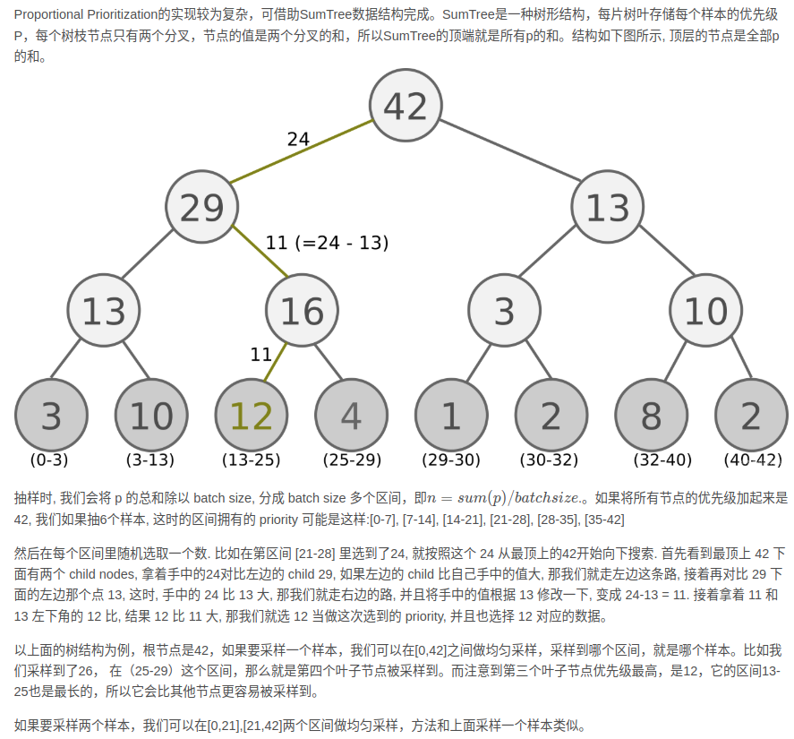
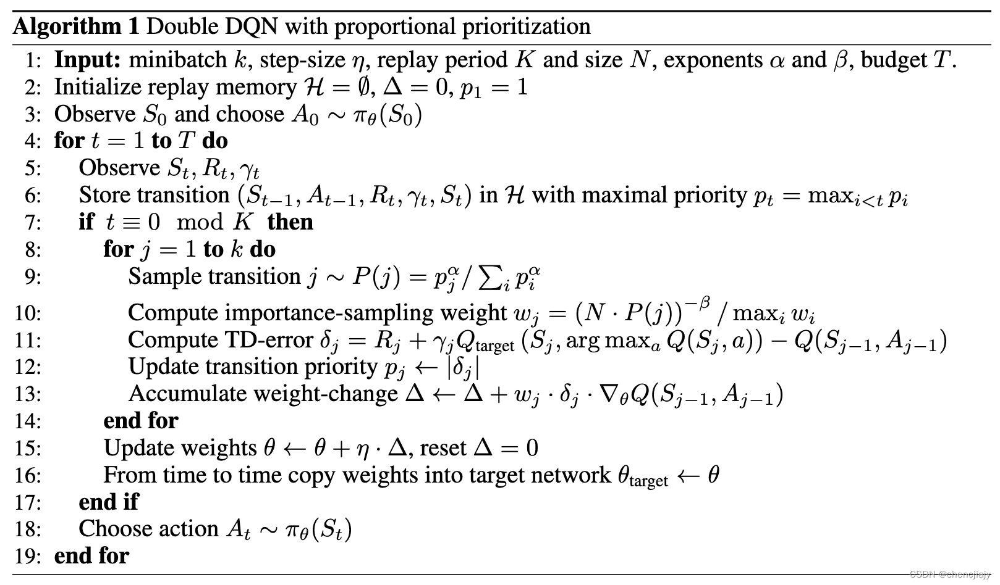
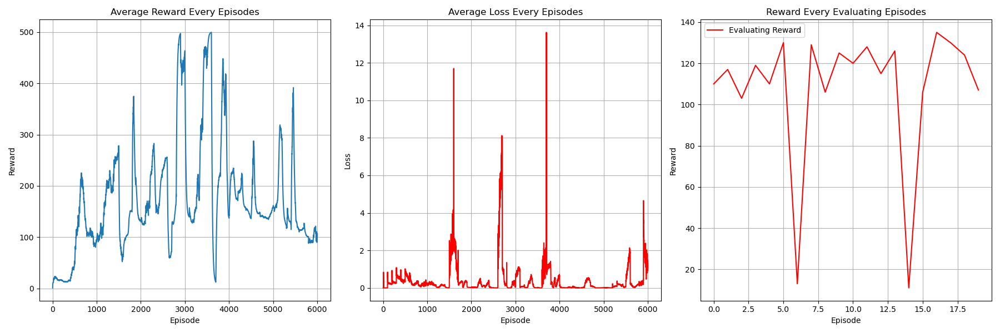

# PER DQN Algorithm
## Paper
* PER: https://arxiv.org/abs/1511.05952
## Main Algorithm
* Using target network to find maximal q value of next state and evaluate target q value 
  * $y_t = r_{t+1}+\gamma max_{a'}\hat Q(s_{t+1},a',\hat w)$
* with Priority Experience Replay buffer
  * Sum tree structure to help create priority buffer
    * 
  * Stochastic Prioritization
    * Sampling probability $P(i)=\frac{p^\alpha_i}{\Sigma_kp^\alpha_k}$
    * ${p_i}$ is priority (TD-error term)
      * ${p_i}$ will add small value so as to prevent never sampling 
    * $\alpha$ imply how important for priority, $\alpha=0$ is normal DQN 
  * Annealing Bias, importance-sampling (IS) weights
    * $w_i=(\frac{1}{N}\frac{1}{P(i)})^\beta$
    * $\beta$ imply how much impact of the PER smapling, $\beta=0$ is canceling important sampling, while $\beta=1$ is mitigate all impact of important sampling which is just normal DQN
* 
## Figure Out
* Value-Based
* Model-Free
* OFF-Policy
* Per-episode training instead of per-step
* Hard copy every 100 step when using target separation
* Epsilon greedy decay as episodes increase
* Priority Experience Replay buffer implementation
* CUDA device usage
* Target evaluation without gradient back propagation (add model.eval)
* total_episodes = 6000
* batch_size = 256
* gamma      = 0.95
* replay_buffer capacity 10000
* ewma_reward usage
* lr = 0.0001
## Environment and Target Game
* gym: 0.26.2
* numpy: 1.26.4 
* pytorch: 2.5.0
* environment: "CartPole-v1"
## Result
* target q separation DQN w/o PER 
  * 
* target q separation DQN w/ PER 
  * able to obtain better performance than w/o PER within 6000 episodes training
  * 