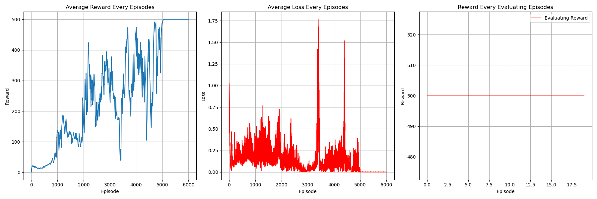

# PER DQN Algorithm
## Paper
* PER: https://arxiv.org/abs/1511.05952
## Main Algorithm
* Using target network to find maximal q value of next state and evaluate target q value 
  * $y_t = r_{t+1}+\gamma max_{a'}\hat Q(s_{t+1},a',\hat w)$
* w/o target q separation
  * 
* w/ target q separation
  * 
  * 
## Figure Out
* Value-Based
* Model-Free
* OFF-Policy
* Per-episode training instead of per-step
* Hard copy every 100 step when using target separation
* Epsilon greedy decay as episodes increase
* CUDA device usage
* Target evaluation without gradient back propagation (add model.eval)
* total_episodes = 20000
* batch_size = 256
* gamma      = 0.99
* replay_buffer capacity 10000
* ewma_reward usage
## Environment and Target Game
* gym: 0.26.2
* numpy: 1.26.4 
* pytorch: 2.0.1 
* environment: "CartPole-v1"
## Result
* w/o target q separation
  * 
* w/ target q separation
  * 