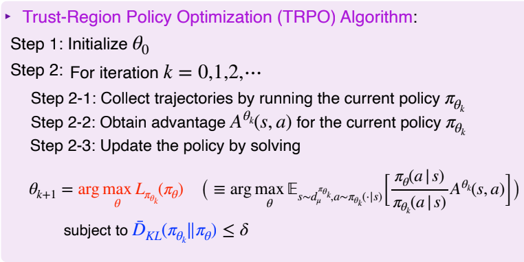
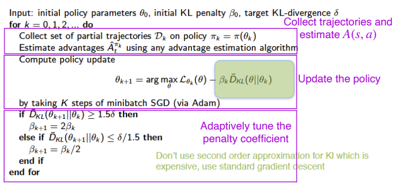
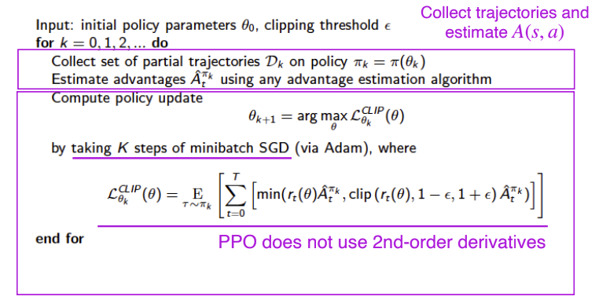
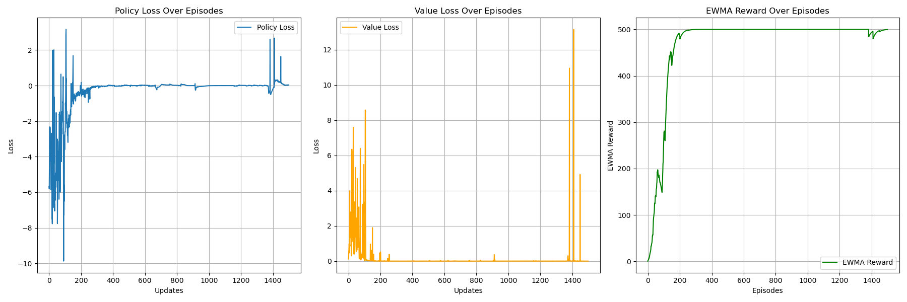
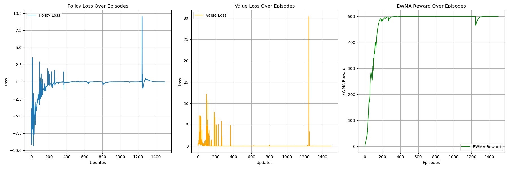
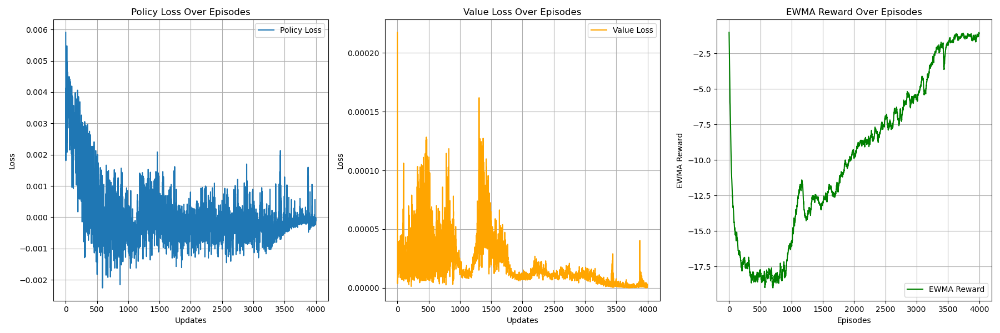
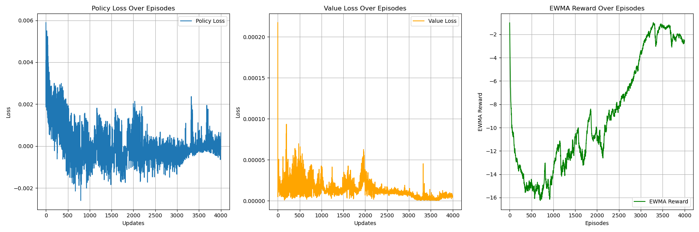

# Proximal Policy Optimization (PPO) Algorithm
## Paper
* TRPO
  * https://arxiv.org/abs/1502.05477
* PPO
  * https://arxiv.org/abs/1707.06347
* PPO Clip
  * https://arxiv.org/abs/2110.13799
  * https://arxiv.org/abs/2312.12065
* GAE: https://arxiv.org/abs/1506.02438 
## Main Algorithm
* TRPO
  * Trust-Region Policy Optimization
    * Insensitive to learning rate
    * Capable to reach similar results with less data
  * First, conventional objective of RL
    * $V_\pi=\Sigma_a\pi_\theta(a|S)Q_{\pi_\theta}(S,a)$
  * Second, surrogate function by Performance Difference Lemma
    * $V_\pi=\Sigma_a\pi_\theta(a|S)Q_{\pi_\theta}(S,a)$
    * $=\Sigma_a\pi_{\theta_k}(a|S)\frac{\pi_{\theta}(a|S)}{\pi_{\theta_k}(a|S)}Q_{\pi_{\theta_k}}(S,a)=L_{\pi_{\theta_k}}(\pi_{\theta})$
    * where $L$ is surrogate function of $\pi_{\theta}$ under $\pi_{\theta_k}$
* From TRPO to PPO
  * Replace KL constraint with Lagrangian method by adding penalty terms
  * Dynamically change penalty terms
* From PPO to PPO Clip
  * Just clamp Surrogate Objective (ratio) instead of using KL penalty
* Actor-Critic
  * Deep neural networks for function approximation
  * Sampling action by probability
* TRPO algorithm 
* PPO algorithm, or called PPO KL penalty 
  * For continuous, use $\frac{1}{L}\Sigma(log(\pi_{\theta_k}(a|s)) - log(\pi_{\theta}(a|s)))$ to approximate KL divergence of Normal distribution rather than $\Sigma\pi_{\theta_k}(a|s)(log(\pi_{\theta_k}(a|s)) - log(\pi_{\theta}(a|s)))$ 
* PPO Clip algorithm 
* GAE Estimation
  * Figure out handle terminated state and truncated state
* For continuous env, rewards should scale to samller ones.
  * Due to reward scaling, we need to use another evaluation procedure to check performance.
## Figure Out
* Policy-Based
* Model-Free
* ON-Policy
* Actor-Critic
* CUDA device usage
* Discrete:
  learning rate = 0.01
  * total_episodes = 1500
  * gamma = 0.98
  * gae_lambda = 0.95
  * hidden_size = 128
  * kl_beta = 0.1
  * target_kl = 0.01
  * clip_param = 0.2
  * ppo_epoch = 10
  * lr_a=1e-3
  * lr_c=1e-2
* Continuous:
  * total_episodes = 4000
  * gamma = 0.99
  * gae_lambda = 0.95
  * hidden_size = 64
  * kl_beta = 5
  * target_kl = 0.03
  * clip_param = 0.2
  * ppo_epoch = 10
  * entropy_coef = 0.01
  * lr_a=3e-4
  * lr_c=3e-4
* ewma_reward usage
## Environment and Target Game
* gym: 0.26.2
* numpy: 1.26.4 
* pytorch: 2.5.0 
* environment: "CartPole-v1" and "Pendulum-v1"
## Result
* PPO KL penalty for Discrete "CartPole-v1"
  * 
* PPO Clip for Discrete "CartPole-v1"
  * 
* PPO KL penalty for Continuous "Pendulum-v1"
  * 
* PPO Clip for Continuous "Pendulum-v1"
  * 