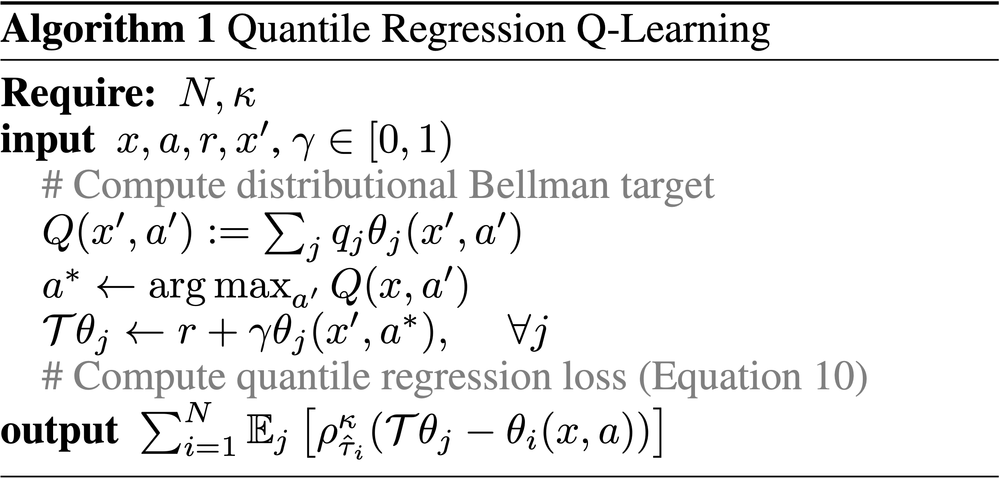
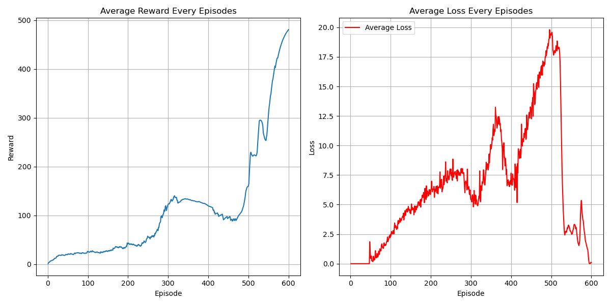

# Quantile Regression DQN (QRDQN) Algorithm
## Paper
* https://arxiv.org/abs/1710.10044
## Main Algorithm
* Using quantile to express distribution to avoid any projection of adoption
  * 
* Using Quantile Regression Loss from Target Quantiles
  * $\Large L_{QR}(x;Z,\tau)=E_Z[\rho_\tau(Z-x)]=E_{z\sim B^*Z_{\hat\theta}(s,a)}[\rho_\tau(z-Z_{\theta}(s,a))]$
  * $\Large B^*Z_{\hat\theta}(s,a)=r+\gamma Z_{\hat\theta}(s',a^*)$
  * $\Large \rho_\tau(u)=u(\tau-\mathbb I_{\{u<0\}})$ becomes $\Large \rho^\kappa_\tau(u)=L_\kappa(u)|\tau-\mathbb I_{\{u<0\}}|$
    * $\Large L_\kappa(u)$ is Huber loss
* Procedures
  1. Target quantile calculation
  2. Predicted quantile
  3. Pairwise Differences
  4. Including Huber loss to reduce sensitivity to outliers
       * Using smooth_l1_loss instead of original Huber loss
       * $`\Large \text{SmoothL1}(y_{predict},y_{trueth}) =
\begin{cases}
\frac{1}{2} (y_{predict}-y_{trueth})^2, & \text{if } |y_{predict}-y_{trueth}| \le 1 \\
|y_{predict}-y_{trueth}| - \frac{1}{2}, & \text{otherwise}
\end{cases}`$
  1. Quantile Thresholds (τ)
  2. Incorporating Huber loss and quantile weights to calculate Asymmetric Quantile Penalty 
        * Higher quantiles (τ>0.5) penalize under-predictions more heavily
        * Lower quantiles (τ<0.5) penalize over-predictions more heavily
* 
* another version 
## Figure Out
* Distributional Value-Based
* Model-Free
* OFF-Policy
* Per-step training
* Hard copy every 100 step
* Epsilon greedy decay as episodes increase
* CUDA device usage
* Target evaluation without gradient back propagation (add model.eval)
* total_episodes = 10000 with early terminating
* batch_size = 64
* gamma      = 0.99
* replay_buffer capacity 10000
* num_support Quantile = 8
* ewma_reward usage
## Environment and Target Game
* gym: 0.26.2
* numpy: 1.26.4 
* pytorch: 2.0.1 
* environment: "CartPole-v1"
## Result
* 
