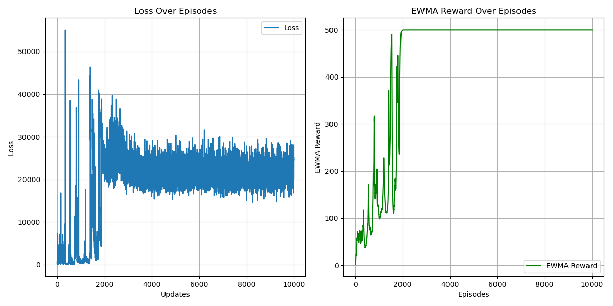

# REINFORCE (Monte Carlo policy gradient) Algorithm
## Paper
* REINFORCE
  * https://link.springer.com/article/10.1007/BF00992696
  * https://papers.nips.cc/paper_files/paper/1999/hash/464d828b85b0bed98e80ade0a5c43b0f-Abstract.html
  * http://incompleteideas.net/book/the-book-2nd.html
* GAE: https://arxiv.org/abs/1506.02438
## Main Algorithm
* Actor-Critic
  * Deep neural networks for function approximation
  * Combining actor and critic
  * Sampling action by probability
* Monte Carlo Estimation
* With/without variance reduction
  * $\nabla_\theta J(\theta)=\mathbb E_{\pi}[G_t\nabla_\theta log_{\pi_\theta}(a_t|s_t)]=\mathbb E_{\pi}[Q^\pi(s,a)\nabla_\theta log_{\pi_\theta}(a|s)]$
  * Baseline
    * $=\mathbb E_{\pi}[A^\pi(s,a)\nabla_\theta log_{\pi_\theta}(a|s)]$
    * where $A^\pi(s,a)=Q^\pi(s,a)-V^\pi(s)$
  * GAE
    * $=\mathbb E_{\pi}[A^{GAE(\gamma,\lambda)}(s)\nabla_\theta log_{\pi_\theta}(a|s)]$
* 
## Figure Out
* Policy-Based
* Model-Free
* ON-Policy
* Actor-Critic
* Stochastic PG
  * Using one trajectory sample instead of expectation
  * Use state value of one trajectory sample as unbiased estimate
* CUDA device usage
* total_episodes = 10000
* hidden_size = 128
* gamma = 0.999
* ewma_reward usage
## Environment and Target Game
* gym: 0.26.2
* numpy: 1.26.4 
* pytorch: 2.5.0 
* environment: "CartPole-v1"
## Result
* Normal REINFORCE
  * 
* With Baseline
  * 
* With GAE
  * 