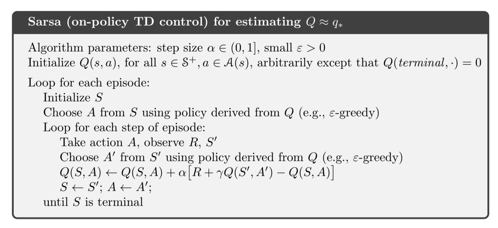
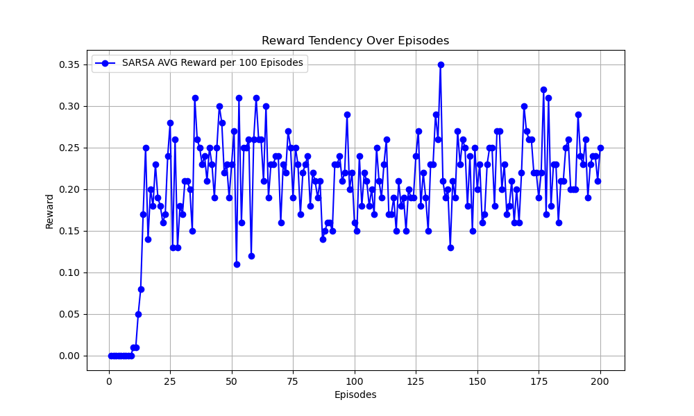

# SARSA Algorithm
## Paper
* https://mi.eng.cam.ac.uk/reports/svr-ftp/auto-pdf/rummery_tr166.pdf
## Main Algorithm
* $\Large Q(S, A) = Q(S, A) + \alpha(R + (\gamma Q(S', A') - Q(S, A))$
* 
## Figure Out
* Value-Based
* Model-Free
* ON-Policy
* Epsilon greedy
  * epsilon = 0.2
* total_episodes = 20000
* max_steps = 100
* alpha = 0.1
* gamma = 1
  * finite step
## Environment and Target Game
* gym: 0.26.2
* numpy: 1.26.4 
* pytorch: 2.0.1 
* environment: "FrozenLake-v1"
## Result
* 
