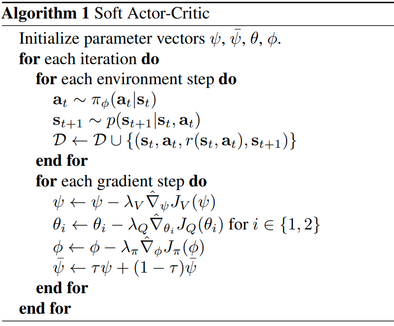
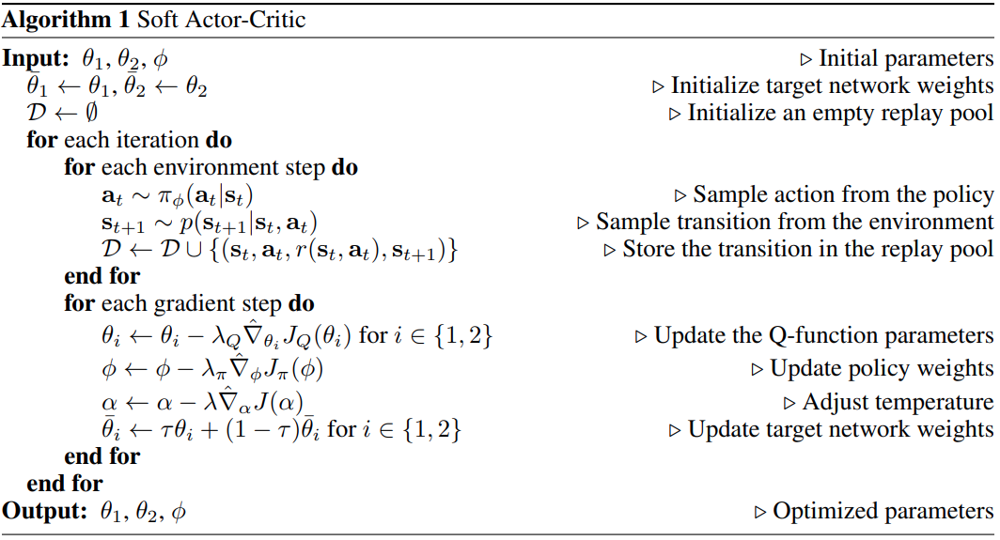
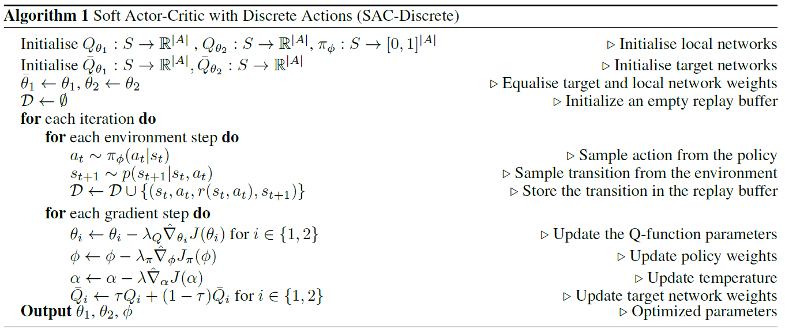
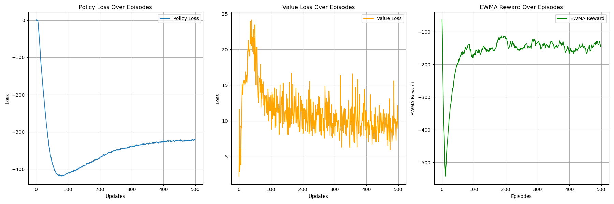
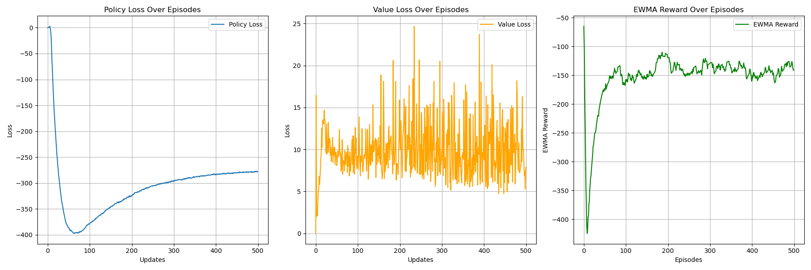
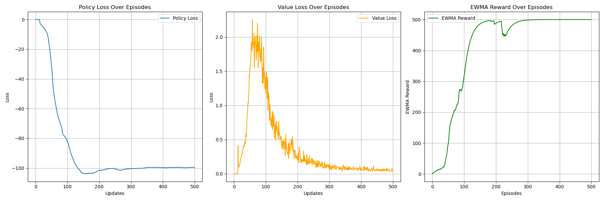

# Soft Actor Critic (SAC) Algorithm
## Paper
* Original Version: https://arxiv.org/abs/1801.01290
  * w/ value network
* Revised Version: https://arxiv.org/abs/1812.05905
  * w/o value network and w/ automatically adapting alpha
* for Discrete: https://arxiv.org/abs/1910.07207
## Main Algorithm
* Maximum long term total reward
  * w/o entropy:
    * Optimal Policy: $`\Large \pi^*_{std}=\arg\max_\pi\Sigma \Bbb E_{(s_t,a_t)}[r(s_t,a_t)]`$
    * Objective: $\Large J(\pi)=\Sigma\Bbb E_{(s_t,a_t)}[r(s_t,a_t)]$
  * w/ entropy:
    * Optimal Policy: $`\Large \pi^*_{entropy}=\arg\max_\pi\Sigma \Bbb E_{(s_t,a_t)}[r(s_t,a_t)+\alpha\mathcal H(\pi(\cdot|s_t))]`$
    * Objective: $\Large J(\pi)=\Sigma\Bbb E_{(s_t,a_t)}[r(s_t,a_t)+\alpha\mathcal H(\pi(\cdot|s_t))]$
    * Entropy: $\Large \mathcal H(P)=\Bbb{E}_{x\sim P}[-\log P(x)]=-\Sigma_xP(x)\log P(x)$
* Soft Policy Improvement:
  * $`\Large \pi_{new} =\arg\min D_{KL}(\pi(\cdot|s_t)||\frac{\exp(Q^{\pi_{old}}_{soft}(s_t,\cdot))}{Z^{\pi_{old}}(s_t)})`$
  * since, $\Large \pi(a_t|s_t)\propto\exp(-\mathcal{E}(s_t,a_t))$ 
    * And $\Large \mathcal{E}(s_t,a_t)=-\frac{1}{\alpha}Q^\pi_{soft}(s_t,a_t)$
    * Then, using softMAX
* Soft Policy Evaluation:
  * Soft Q: 
    * $\Large Q^\pi_{soft}(s_t,a_t)=r_t+\gamma\Bbb E_{s_{t+1}}[V^\pi_{soft}(s_{t+1})]$
  * Soft V: 
    * $\Large V^\pi_{soft}(s_t)=\Bbb E_{a\sim\pi}[Q^\pi_{soft}(s_t,a_t)-\alpha\log\pi(a_t|s_t)]\\ =\alpha\log\Sigma_a\exp(\frac{Q^\pi_{soft}(s_t,a_t)}{\alpha})$
* SAC Objective:
  * $\Large J_Q(\theta)=\Bbb E_{(s_t,a_t)}[\frac{1}{2}(Q^\theta_{soft}(s_t,a_t)-\widehat{Q^{\theta}_{soft}}(s_t,a_t))^2]$
    * $`\Large \widehat{Q^{\theta}_{soft}}(s_t,a_t)=r_t+\gamma\Bbb E_{s_{t+1}}[{V^{\bar\psi}_{soft}}(s_{t+1})]`$
    * Using SGD, $`\Large \widehat{Q^{\theta}_{soft}}(s_t,a_t)\simeq r_t+\gamma {V^{\bar\psi}_{soft}}(s_{t+1})`$
    * Advanced version:
      * $`\Large \widehat{Q^{\theta}_{soft}}(s_t,a_t)=r_t+\gamma\Bbb E_{a\sim\pi}[\min_{1,2}Q^{\bar\theta}_{soft}(s_t+1,a_t+1)-\alpha\log\pi_\phi(a_t+1|s_t+1)]`$
      * SGD, $`\Large \widehat{Q^{\theta}_{soft}}(s_t,a_t)\simeq r_t+\gamma(\min_{1,2}Q^{\bar\theta}_{soft}(s_t+1,a_t+1)-\alpha\log\pi_\phi(a_t+1|s_t+1))`$
    * Advanced version for discrete:
      * SGD, $`\Large \widehat{Q^{\theta}_{soft}}(s_t,a_t)\simeq r_t+\gamma[\pi_t(a_t+1|s_t+1)(\min_{1,2}Q^{\bar\theta}_{soft}(s_t+1,a_t+1)-\alpha\log\pi_\phi(a_t+1|s_t+1))]=r_t+\gamma[\pi_t(s_t+1)^T(\min_{1,2}Q^{\bar \theta}_{soft}(s_t+1)-\alpha\log\pi_\phi(s_t+1))]`$
  * $\Large J_V(\psi)=\Bbb E_{s_t}[\frac{1}{2}(V^\psi_{soft}(s_t)-\widehat{V^{\psi}_{soft}}(s_t))^2]$
    * $`\Large \widehat{V^{\psi}_{soft}}(s_t)=\Bbb E_{a\sim\pi}[\min_{1,2}Q^\theta_{soft}(s_t,a_t)-\alpha\log\pi_\phi(a_t|s_t)]`$
    * Using SGD, $`\Large \widehat{V^{\psi}_{soft}}(s_t)\simeq \min_{1,2}Q^\theta_{soft}(s_t,a_t)-\alpha\log\pi_\phi(a_t|s_t)`$
  * $`\Large J_\pi(\phi)=(\min)\Bbb{E_{a_t,s_t}}[D_{KL}(\pi_\phi(\cdot|s_t)||\frac{\exp(Q^\theta_{soft}(s_t,\cdot))}{Z_\theta(s_t)})] =(\min)\Bbb E[\alpha\log\pi_\phi(a_t|s_t)-\min_{1,2}Q^\theta_{soft}(s_t,a_t)]`$
    * Also equal to $`\Large (\max)\Bbb E[\min_{1,2}Q^\theta_{soft}(s_t,a_t)-\alpha\log\pi_\phi(a_t|s_t)]=(\max)\Bbb E[\Sigma_t r(s_t,a_t)+\alpha\mathcal H(\pi(\cdot|s_t))]`$
      * Maximum long term total reward with entropy
    * $\Large a_t=f_\phi(\epsilon_t;s_t)$, $\Large \epsilon$ is noise
      * Reparameterization trick only for continuous action space
    * Objective is  minimizing the KL-divergence
    * Advanced version for discrete:
      * $`\Large J_\pi(\phi)=(\min) \pi_t(a_t|s_t)[\alpha\log\pi_\phi(a_t|s_t)-\min_{1,2}Q^\theta_{soft}(s_t,a_t)]=(\min) \pi_t(s_t)^T[\alpha\log\pi_\phi(s_t)-\min_{1,2}Q^\theta_{soft}(s_t)]`$
  * $\Large J(\alpha)=\Bbb{E}[-\alpha\log\pi_t(a_t|s_t)-\alpha\bar {\mathcal H}]$
    * Advanced version for discrete
      * $\Large J(\alpha)=\pi_t(a_t|s_t)[-\alpha\log\pi_t(a_t|s_t)-\alpha\bar {\mathcal H}]=\pi_t(s_t)^T[-\alpha\log\pi_t(s_t)-\alpha\bar {\mathcal H}]$
    * $\Large E[-\log\pi_t(a_t|s_t)]$ is current entropy
      * in continuous, can use $\Large -\log\pi_t(f_\phi(\epsilon_t;s_t)|s_t)$ via SGD and reparameterization trick to approximate
      * in discrete, can directly calcuate entropy $\Large -\Sigma_{a_t}\pi_t(a_t|s_t)\log\pi_t(a_t|s_t)$
* Original version SAC:
  * 
  * Value net, target Value net, 2 Q net (TD3), Policy net
* Advanced and Revised version SAC:
  * 
  * 2 Q net, 2 target Q net, Policy net
* Advanced and Revised version SAC for discrete:
  * 
  * 2 Q net, 2 target Q net, Policy net
## Figure Out
* Policy-Based
* Model-Free
* OFF-Policy
* Per-step training
* Soft copy every step
* CUDA device usage
* Target evaluation without gradient back propagation (add model.eval)
* total_episodes = 500
* batch_size = 128(original ver)/300(revised ver)
* gamma      = 0.99
* soft_tau   = 1e-2
* target entropy for advanced SAC version: -2
  * in continuous, entropy can be negative since PDF might larger than 1
    * $\Large -\int \pi_t(a_t|s_t)\log\pi_t(a_t|s_t)d{a_t}$ which might be negative since $\Large \log\pi_t(a_t|s_t)$ might be positive
    * from paper suggestion, $\Large -1*\dim(a)$
  * in discrete, entropy always larger than zero since PMF smaller than 1
    * $\Large -\Sigma_{a_t}\pi_t(a_t|s_t)\log\pi_t(a_t|s_t)$
    * hence, set target entropy larger than zero
      * from paper suggestion, $\Large 0.98*(-1*\log(1/\dim(a)))$ which is positive since $\Large \log\pi_t(a_t|s_t)$ must be negative
      * however, for better effect, choosing 0.6
* value learning rate = 3e-4
* soft_q learning rate = 3e-4
* policy learning rate = 3e-4
* alpha learning rate = 3e-4
* replay_buffer capacity 1000000
* ewma_reward usage
## Environment and Target Game
* gym: 0.26.2
* numpy: 1.26.4 
* pytorch: 2.5.0
* environment: 
  * continuous: "Pendulum-v1"
  * discrete: "CartPole-v1"
## Result
* Original SAC with value network
  * 
* Revised and advanced SAC without value network and with automatically adapting alpha
  * 
* Advanced SAC for discrete action space
  * 
