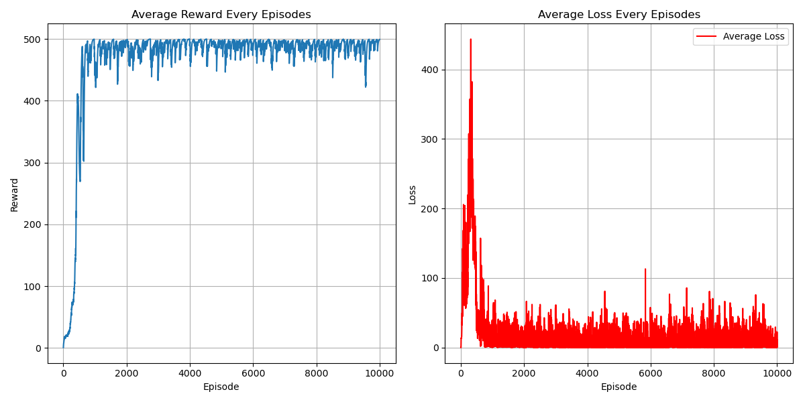

# Soft DQN (Soft Q Learning) Algorithm
## Paper
* https://proceedings.mlr.press/v70/haarnoja17a.html
* https://arxiv.org/abs/1912.10891
## Main Algorithm
* Maximum long term total reward
  * w/o entropy:
    * Optimal Policy: $\pi^*_{std}=\argmax_\pi\Sigma \Bbb E_{(s_t,a_t)}[r(s_t,a_t)]$
    * Objective: $J(\pi)=\Sigma\Bbb E_{(s_t,a_t)}[r(s_t,a_t)]$
  * w/ entropy:
    * Optimal Policy: $\pi^*_{entropy}=\argmax_\pi\Sigma \Bbb E_{(s_t,a_t)}[r(s_t,a_t)+\alpha\mathcal H(\pi(\cdot|s_t))]$
    * Objective: $J(\pi)=\Sigma\Bbb E_{(s_t,a_t)}[r(s_t,a_t)+\alpha\mathcal H(\pi(\cdot|s_t))]$
* Soft Policy Improvement:
  * $\pi(a_t|s_t)=\frac{\exp(Q^\pi_{soft}(s_t,a_t)/\alpha)}{\Sigma_{a'}\exp(Q^\pi_{soft}(s_t,a'_t)/\alpha)}\\ =\frac{\exp(Q^\pi_{soft}(s_t,a_t)/\alpha)}{\exp(V^\pi_{soft}(s_t)/\alpha)}\\=\exp(\frac{Q^\pi_{soft}(s_t,a_t)-V^\pi_{soft}(s_t)}{\alpha})$
  * since, $\pi(a_t|s_t)\propto\exp(-\mathcal{E}(s_t,a_t))$ 
    * And $\mathcal{E}(s_t,a_t)=-\frac{1}{\alpha}Q^\pi_{soft}(s_t,a_t)$
    * Then, using softMAX
* Soft Policy Evaluation:
  * Soft Q: 
    * $Q^\pi_{soft}(s_t,a_t)=r_t+\gamma\Bbb E_{s_{t+1}}[V^\pi_{soft}(s_{t+1})]$
  * Soft V: 
    * $V^\pi_{soft}(s_t)=\Bbb E_{a\sim\pi}[Q^\pi_{soft}(s_t,a_t)-\alpha\log\pi(a_t|s_t)]\\ =\alpha\log\Sigma_a\exp(\frac{Q^\pi_{soft}(s_t,a_t)}{\alpha})$
* Soft Q Learning Objective:
  * $J_Q(\theta)=\Bbb E_{(s_t,a_t)}[\frac{1}{2}(\hat Q^{\bar\theta}_{soft}(s_t,a_t)-Q^\theta_{soft}(s_t,a_t))^2]$
    * $\hat Q^{\bar\theta}_{soft}(s_t,a_t)=r_t+\gamma\Bbb E_{s_{t+1}}[V^{\bar\theta}_{soft}(s_{t+1})]$
    * Using SGD, $\hat Q^{\bar\theta}_{soft}(s_t,a_t)\simeq r_t+\gamma V^{\bar\theta}_{soft}(s_{t+1})$
* 
## Figure Out
* Value-Based
* Model-Free
* OFF-Policy
* Per-step training
* Hard copy every 4 step when using target separation
* CUDA device usage
* Target evaluation without gradient back propagation (add model.eval)
* total_episodes = 10000
* batch_size = 16
* gamma      = 0.99
* replay_buffer capacity 50000
* ewma_reward usage
## Environment and Target Game
* gym: 0.26.2
* numpy: 1.26.4 
* pytorch: 2.5.0
* environment: "CartPole-v1"
## Result
* 
